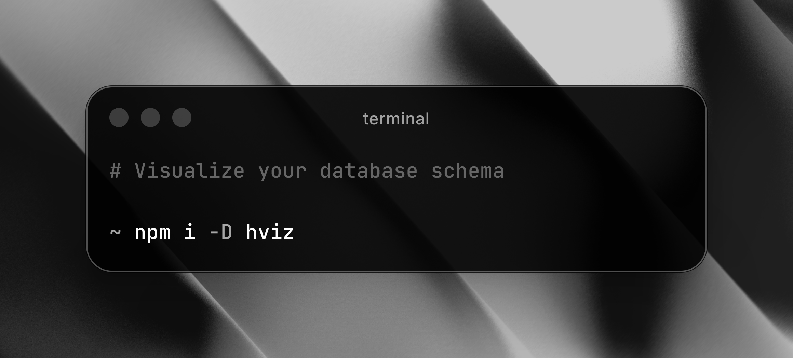

<div align="center">

# hviz

**CLI tool for visualizing your database schema**

[](https://www.npmjs.com/package/hviz)
[](https://www.npmjs.com/package/hviz)

[Website](https://www.hviz.tech) • [Report Bug](https://github.com/husamql3/hviz/issues) • [Request Feature](https://github.com/husamql3/hviz/issues)



</div>

---

## 🚀 Quick Start

```bash
# Run with npx (no installation needed)
npx hviz

# Or with bunx
bunx hviz

# Or with Docker (no installation needed)
docker run --rm -p 3000:3333 \
  -v "$(pwd)/prisma":/app/prisma \
  hviz --type prisma --schema /app/prisma/schema.prisma
```

That's it! hviz will guide you through the rest with interactive prompts.

---

## 📦 Installation

Install globally for quick access:

```bash
# npm
npm install -g hviz

# bun
bun install -g hviz
```

Or add to your project as a dev dependency:

```bash
# npm
npm install -D hviz

# bun
bun install -D hviz
```

### 🐳 Docker

Use Docker without any local installation:

```bash
# Build the image
docker build -t hviz .

# Run with your schema
docker run --rm -p 3000:3333 \
  -v "$(pwd)/prisma":/app/prisma \
  hviz --type prisma --schema /app/prisma/schema.prisma
```

Then open your browser at `http://localhost:3000`

---

## 🎯 Usage

### Interactive Mode (Recommended)

Simply run hviz and follow the prompts:

```bash
hviz
```

The CLI will ask you:

1. **Which ORM you're using** (Prisma, Drizzle, or TypeORM)
2. **Path to your schema file** (with smart suggestions)

Then it will:

- Parse your schema
- Generate an interactive ERD
- Start a local server
- Open the visualization in your browser

### Non-Interactive Mode

Specify all options directly:

```bash
# Prisma
hviz --type prisma --schema prisma/schema.prisma

# Drizzle
hviz --type drizzle --schema drizzle/schema.ts

# TypeORM
hviz --type typeorm --schema typeorm/schema.ts

# Custom port
hviz --type prisma --schema prisma/schema.prisma --port 4000
```

### 🐳 Docker Usage

Run HViz in Docker with different ORMs:

```bash
# Prisma
docker run --rm -p 3000:3333 \
  -v "$(pwd)/prisma":/app/prisma \
  hviz --type prisma --schema /app/prisma/schema.prisma

# Drizzle
docker run --rm -p 3000:3333 \
  -v "$(pwd)/drizzle":/app/drizzle \
  hviz --type drizzle --schema /app/drizzle/schema.ts

# TypeORM
docker run --rm -p 3000:3333 \
  -v "$(pwd)/src/entities":/app/entities \
  hviz --type typeorm --schema /app/entities

# Custom port
docker run --rm -p 8080:3333 \
  -v "$(pwd)/prisma":/app/prisma \
  hviz --type prisma --schema /app/prisma/schema.prisma
```

Access the visualization at `http://localhost:3000` (or at `http://localhost:{HOST_PORT}` if you specified a custom port, e.g., `http://localhost:8080`)

---

## 🛠️ CLI Options

| Option      | Alias | Description                         | Default            |
| ----------- | ----- | ----------------------------------- | ------------------ |
| `--type`    | `-t`  | ORM type (prisma, drizzle, typeorm) | Interactive prompt |
| `--schema`  | `-s`  | Path to schema file                 | Interactive prompt |
| `--port`    | `-p`  | Port to run server on               | `3000`             |
| `--version` | `-v`  | Show version                        | -                  |

---

## 🤝 Contributing

Please read our [**Contributing Guidelines**](./CONTRIBUTING.md) for detailed information about

---

## 📝 License

MIT

---

## 🔗 Links

- **Website**: [hviz.tech](https://www.hviz.tech)
- **Author**: [@husamql3](https://x.com/husamql3)
